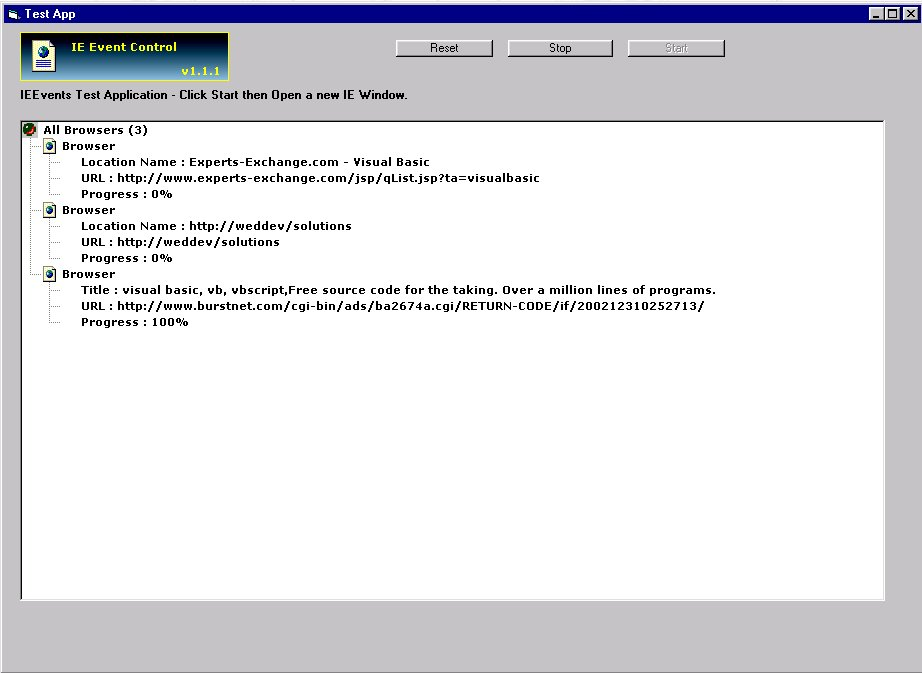



## Capture IE Events \(Updated\)

### Description

Capture Events from all your instances of Internet explorer.

Modify Browser properties through the exposed collection, cancel annoying popup windows or simply spy on a users browsing habits.
 
### More Info
 

             |
---                |---
**Submitted On**   |2002-02-14 10:16:34
**By**             |[Crazyman](https://github.com/Planet-Source-Code/PSCIndex/blob/master/ByAuthor/crazyman.md)
**Level**          |Intermediate
**User Rating**    |4.5 (54 globes from 12 users)
**Compatibility**  |VB 5\.0, VB 6\.0
**Category**       |[Custom Controls/ Forms/  Menus](https://github.com/Planet-Source-Code/PSCIndex/blob/master/ByCategory/custom-controls-forms-menus__1-4.md)
**World**          |[Visual Basic](https://github.com/Planet-Source-Code/PSCIndex/blob/master/ByWorld/visual-basic.md)
**Archive File**   |[Capture\_IE552302142002\.zip](https://github.com/Planet-Source-Code/crazyman-capture-ie-events-updated__1-31098/archive/master.zip)

